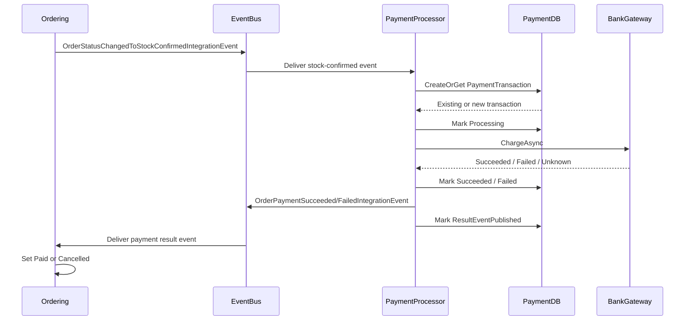
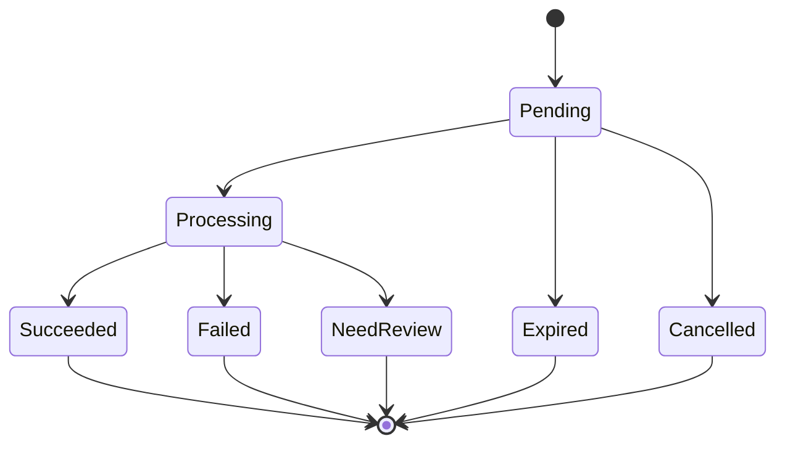

# Payment Service Proposal - Slide Content

Purpose: nội dung chi tiết để chuyển template `Sample 2.pptx` thành proposal cho Payment Service trong eShop, dựa trên phần PaymentProcessor đã implement gần đây.

Scope của tài liệu:
- Chỉ mô tả và lập proposal dựa trên code hiện tại.
- Không giả định đã có real bank integration khi code hiện tại mới dùng simulated gateway.
- Tách rõ phần đã implement, phần gap, và roadmap triển khai tiếp.

Các source code chính đã đối chiếu:
- `src/PaymentProcessor/Program.cs`
- `src/PaymentProcessor/Domain/PaymentTransaction.cs`
- `src/PaymentProcessor/Infrastructure/EntityConfigurations/PaymentTransactionEntityTypeConfiguration.cs`
- `src/PaymentProcessor/Services/PaymentTransactionService.cs`
- `src/PaymentProcessor/IntegrationEvents/EventHandling/OrderStatusChangedToStockConfirmedIntegrationEventHandler.cs`
- `src/PaymentProcessor/Workers/ReconciliationWorker.cs`
- `src/Ordering.API/Application/DomainEventHandlers/OrderStatusChangedToStockConfirmedDomainEventHandler.cs`
- `src/Ordering.API/Extensions/Extensions.cs`
- `src/eShop.AppHost/Program.cs`
- `tests/PaymentProcessor.UnitTests/OrderStatusChangedToStockConfirmedIntegrationEventHandlerTest.cs`

Validation hiện tại:
- `dotnet test tests\PaymentProcessor.UnitTests\PaymentProcessor.UnitTests.csproj --no-restore`
- Result: Passed, 3 tests.

---

## Slide 1 - Title

### Slide Title
Technical Proposal

### Main Text
Payment Service Modernization for eShop

Event-driven payment processing, transaction idempotency, reconciliation, and bank integration readiness

Date: June 2026

### Speaker Notes
Proposal này tập trung vào luồng Payment Service đã được tách khỏi Ordering trong eShop. Mục tiêu là trình bày hiện trạng đã implement, phạm vi Payment Service, các service bị ảnh hưởng, các thiết kế kỹ thuật chính, và roadmap để đưa từ simulated payment flow sang production-ready bank payment flow.

### Visual Suggestion
Hero visual: simplified payment flow icon set: Order -> EventBus -> Payment Service -> Bank Gateway -> Ordering.

---

## Slide 2 - Table of Contents

### Slide Title
Table of Contents

### Main Text
1. Executive Summary
2. Current Payment Workflow
3. Payment Service Scope
4. Implemented Architecture
5. Payment Transaction Database Design
6. Idempotency Design
7. Bank Callback and Webhook Verification
8. Payment Reconciliation Worker
9. EventBus and Ordering Workflow Impact
10. Roadmap and Task Breakdown
11. QA and Risk Management
12. Appendix

### Speaker Notes
Structure này giữ tinh thần proposal template gốc nhưng thay toàn bộ nội dung sang Payment Service. Các phần đầu nêu business/technical context, phần giữa đi sâu vào thiết kế, phần cuối là roadmap, QA và risk.

---

## Slide 3 - Executive Summary

### Slide Title
Executive Summary

### Main Text
eShop hiện đã bắt đầu tách payment processing khỏi Ordering bằng một service riêng: `PaymentProcessor`.

Current implementation already includes:
- Dedicated `PaymentProcessor` service
- Dedicated PostgreSQL database: `paymentdb`
- `PaymentTransactions` schema and EF migrations
- Event-driven trigger from `OrderStatusChangedToStockConfirmedIntegrationEvent`
- Order payment result events: succeeded / failed
- Basic idempotency by `OrderId` and `IdempotencyKey`
- Reconciliation worker for stale and unpublished transactions
- Development-only chaos and repair endpoints
- OpenTelemetry metrics/tracing integration
- Unit tests for core stock-confirmed payment handler

Main remaining work:
- Real bank gateway adapter
- Bank callback/webhook endpoint
- Signature verification and replay protection
- Stronger inbox/outbox guarantees
- Production hardening for reconciliation, observability, and secrets

### Speaker Notes
Thông điệp chính: luồng payment đã có foundation tốt, nhưng vẫn đang ở giai đoạn simulated gateway. Proposal cần nhấn mạnh đây là modernization roadmap: từ prototype/foundation sang production-ready payment service.

### Visual Suggestion
Two-column layout:
- Left: "Implemented Foundation"
- Right: "Production Readiness Roadmap"

---

## Slide 4 - Current Position

### Slide Title
Understanding eShop's Current Payment Position

### Main Text
Current payment flow has moved from Ordering-centered processing to event-driven PaymentProcessor orchestration.

Key improvements already made:
- Payment processing no longer happens directly inside Ordering.
- Ordering emits a stock-confirmed integration event.
- PaymentProcessor creates or reuses a payment transaction.
- Gateway result is translated into payment succeeded / failed events.
- Ordering consumes payment result events and updates order status.

Current limitations:
- Bank gateway is still simulated.
- No bank callback/webhook verification exists yet.
- Payment event publish is not backed by a PaymentProcessor outbox.
- Ordering result handlers still need stronger duplicate-event protection.
- Some legacy comments/simulated delay remain in Ordering payment command.

### Speaker Notes
Slide này nên nói rõ "đã có gì" và "còn thiếu gì" để proposal không overclaim. Hiện tại kiến trúc đã đi đúng hướng: PaymentProcessor là boundary riêng. Nhưng các phần liên quan ngân hàng thật, callback security và production-grade event guarantees vẫn nằm trong roadmap.

---

## Slide 5 - Proposed Solution Roadmap

### Slide Title
Proposed Payment Service Roadmap

### Main Text
We organize the Payment Service rollout into four phases.

Phase 1 - Current Flow Documentation and Stabilization
- Document implemented payment workflow
- Review Ordering/EventBus impact
- Clean up simulated artifacts
- Expand unit tests for success, failure, duplicate, and timeout cases

Phase 2 - Bank Integration Foundation
- Add provider abstraction for real bank gateway
- Design callback/webhook endpoint
- Implement signature verification and replay protection
- Store provider callback metadata

Phase 3 - Reliability and Reconciliation Hardening
- Strengthen reconciliation worker with backoff and leasing
- Add manual review workflow for unresolved transactions
- Recover unpublished payment result events safely
- Add operational dashboards and alerts

Phase 4 - Production Readiness
- Add integration tests and regression scenarios
- Secure secrets and observability configuration
- Define runbook for payment failures
- Prepare deployment and rollback plan

### Speaker Notes
Roadmap này khớp với trạng thái code: phase 1 đã phần lớn xong về implementation foundation, nhưng cần document và cleanup. Phase 2 là phần chưa implement lớn nhất: bank callback/webhook. Phase 3/4 đưa luồng sang mức production.

### Visual Suggestion
Timeline 4 phases from left to right.

---

## Slide 6 - Delivery Plan

### Slide Title
Payment Service Delivery Plan

### Main Text
Stage 1 - Discovery and Proposal Finalization
- Analyze implemented PaymentProcessor flow
- Map existing Ordering workflow
- Confirm database schema and event contracts
- Produce sequence diagram and technical proposal

Stage 2 - Current Implementation Hardening
- Clean Ordering command comments and simulated delay
- Add missing tests around failure, duplicate events, and reconciliation
- Review EventBus subscriptions and event naming consistency

Stage 3 - Bank Callback/Webhook Build
- Define bank callback payload contract
- Implement callback endpoint
- Verify HMAC/signature/timestamp
- Persist callback payload and processing result

Stage 4 - Reconciliation and Production Readiness
- Strengthen retry/backoff/NeedReview behavior
- Add metrics, dashboard, alerts
- Add runbook and release checklist
- Execute regression test on ordering workflow

### Speaker Notes
Delivery plan nên dùng ngôn ngữ "build on top of current implementation". Không phải làm lại PaymentProcessor từ đầu. Trọng tâm là lấp gap để đủ production readiness.

---

## Slide 7 - Proposed Solution Approach

### Slide Title
Proposed Solution Approach

### Main Text
Design principles:
- Event-driven boundary between Ordering and Payment
- Payment transaction as source of truth for payment state
- Idempotent processing for duplicate events and retries
- Provider-agnostic bank gateway abstraction
- Bank callback verification before state mutation
- Reconciliation worker for eventual consistency
- Observability-first operations with traces, metrics, and logs
- Safe recovery using repair tools in development and runbook in production

### Speaker Notes
Slide này là nguyên tắc thiết kế. Payment Service không chỉ charge payment; nó chịu trách nhiệm điều phối state machine, chịu lỗi khi event duplicate, gateway timeout, publish failure hoặc callback đến trễ.

---

## Slide 8 - High-Level Solution Architecture

### Slide Title
Proposed High-Level Payment Architecture

### Main Text
Existing eShop services:
- Basket API
- Catalog API
- Ordering API
- OrderProcessor
- EventBus RabbitMQ
- PostgreSQL
- WebApp / Client apps

Developed Payment capability:
- PaymentProcessor service
- Payment database: `paymentdb`
- Payment transaction table
- Simulated bank gateway adapter
- Reconciliation worker
- Payment telemetry and dashboards

Future bank integration:
- Bank gateway API
- Bank callback/webhook endpoint
- Signature verification module
- Callback audit table
- Manual review and runbook

### Speaker Notes
PaymentProcessor currently participates as an event-driven service. It receives stock-confirmed events and emits payment result events. Future design adds bank callback ingress and stronger persistence for callback audit.

### Visual Suggestion
Architecture diagram:
Ordering API -> RabbitMQ -> PaymentProcessor -> paymentdb
PaymentProcessor -> Bank Gateway
Bank Gateway -> PaymentProcessor callback
PaymentProcessor -> RabbitMQ -> Ordering API

---

## Slide 9 - Current Payment Workflow

### Slide Title
Current Payment Workflow in eShop

### Main Text
Current implemented flow:
1. Order is submitted.
2. Grace period completes.
3. Stock validation succeeds.
4. Ordering moves order to `StockConfirmed`.
5. Ordering publishes `OrderStatusChangedToStockConfirmedIntegrationEvent`.
6. PaymentProcessor receives the event.
7. PaymentProcessor creates or gets `PaymentTransaction`.
8. PaymentProcessor marks transaction as `Processing`.
9. Simulated gateway returns succeeded or failed.
10. PaymentProcessor marks transaction as `Succeeded` or `Failed`.
11. PaymentProcessor publishes payment result event.
12. Ordering consumes result:
    - success -> `SetPaidOrderStatusCommand`
    - failure -> `CancelOrderCommand`

### Speaker Notes
Điểm quan trọng: order chỉ được chuyển sang Paid sau khi PaymentProcessor publish success event. Nếu payment failed, order bị cancel. Đây là thay đổi workflow quan trọng so với luồng payment mô phỏng cũ nằm trong Ordering.

### Visual Suggestion
Sequence diagram with lanes: Ordering, EventBus, PaymentProcessor, BankGateway, PaymentDB.

---

## Slide 10 - Payment Service Scope

### Slide Title
Payment Service Scope and Boundaries

### Main Text
PaymentProcessor owns:
- Payment transaction lifecycle
- Payment state machine
- Gateway charge/query orchestration
- Payment idempotency
- Payment reconciliation
- Payment result event publishing
- Payment-specific telemetry
- Development repair and chaos tooling

PaymentProcessor does not own:
- Order creation
- Basket checkout data
- Stock validation
- Order shipping
- Buyer payment method storage in Ordering
- Web UI checkout experience

Impacted services:
- `Ordering.API`
- `OrderProcessor`
- RabbitMQ EventBus
- PostgreSQL/AppHost
- WebApp order status display
- Observability stack

### Speaker Notes
Boundary rõ giúp tránh scope creep. PaymentProcessor không thay thế Ordering. Nó chỉ xử lý payment transaction và trả kết quả để Ordering quyết định order state.

---

## Slide 11 - Current Implementation Status

### Slide Title
Implementation Status Against Requirements

### Main Text
Implemented:
- PaymentProcessor project and AppHost registration
- PostgreSQL `paymentdb`
- `payment.PaymentTransactions` table
- Basic transaction state machine
- Idempotency by order and payment key
- EventBus subscription for stock-confirmed event
- Payment succeeded/failed result events
- Reconciliation worker
- OpenTelemetry metrics and tracing
- Development-only chaos and repair endpoints
- Unit tests for primary payment handler

Partially implemented:
- Reconciliation worker production behavior
- Event publishing recovery
- Ordering workflow integration

Not implemented yet:
- Real bank gateway adapter
- Bank callback/webhook endpoint
- Callback signature verification
- Replay protection
- Callback audit schema
- Full integration test suite
- Production runbook and alerting rules

### Speaker Notes
Slide này là status matrix cho stakeholder. Dùng màu: green, amber, red.

---

## Slide 12 - Payment Transaction Database Schema

### Slide Title
Payment Transaction Database Design

### Main Text
Current table:
`payment.PaymentTransactions`

Current columns:
- `Id`
- `OrderId`
- `UserId`
- `Amount`
- `Currency`
- `Status`
- `PaymentMethod`
- `IdempotencyKey`
- `GatewayTransactionId`
- `ReconciliationAttempts`
- `LastReconciledAt`
- `ResultEventPublished`
- `CreatedAt`
- `UpdatedAt`

Current indexes:
- Unique index on `OrderId`
- Unique index on `IdempotencyKey`

Current statuses:
- `Pending`
- `Processing`
- `Succeeded`
- `Failed`
- `Expired`
- `Cancelled`
- `NeedReview`

### Speaker Notes
Schema hiện tại đủ cho transaction lifecycle cơ bản. Tuy nhiên, khi tích hợp bank thật, nên bổ sung các field phục vụ callback audit và failure diagnosis như provider status, failure reason, raw callback reference, callback received timestamp, payload hash.

### Visual Suggestion
ERD-style table with status enum callout.

---

## Slide 13 - Proposed Database Extensions

### Slide Title
Recommended Database Extensions for Production

### Main Text
Recommended additions to `PaymentTransactions`:
- `ProviderName`
- `ProviderStatus`
- `ProviderErrorCode`
- `FailureReason`
- `LastProviderResponseAt`
- `LastCallbackReceivedAt`
- `CallbackCorrelationId`
- `PayloadHash`

Recommended new table: `PaymentCallbacks`
- `Id`
- `PaymentTransactionId`
- `ProviderName`
- `ProviderEventId`
- `SignatureValid`
- `ReceivedAt`
- `ProcessedAt`
- `ProcessingStatus`
- `RawPayload`
- `PayloadHash`
- `FailureReason`

Recommended indexes:
- Unique `(ProviderName, ProviderEventId)`
- Index on `PaymentTransactionId`
- Index on `ReceivedAt`
- Index on `ProcessingStatus`

### Speaker Notes
Không nhất thiết implement tất cả ngay, nhưng proposal nên nêu rõ schema production target. `PaymentCallbacks` giúp audit callback, chống duplicate callback và trace sự cố với ngân hàng.

---

## Slide 14 - Idempotency Design

### Slide Title
Idempotency Design

### Main Text
Current implementation:
- Idempotency key format: `order:{orderId}:payment`
- `PaymentTransactionService.CreateOrGetAsync(...)`
- Existing transaction is reused when matching `OrderId` or `IdempotencyKey`
- Unique DB constraints protect against concurrent duplicate creation
- Duplicate processing of terminal transaction does not re-charge gateway
- Non-terminal duplicate can query gateway status for reconciliation

Recommended production extensions:
- Store processed integration event IDs
- Add inbox pattern for PaymentProcessor consumers
- Add outbox pattern for PaymentProcessor result publishing
- Add callback idempotency using provider event ID
- Add payload hash to detect replay with mutated payload
- Add deterministic idempotency keys for retryable bank requests

### Speaker Notes
Current idempotency protects the main duplicate order payment case. Production should cover three duplicate sources: incoming EventBus messages, gateway callback retries, and outgoing result event publish retries.

---

## Slide 15 - Bank Callback and Webhook Verification

### Slide Title
Bank Callback / Webhook Verification Design

### Main Text
Current state:
- No real callback endpoint implemented.
- Gateway is simulated by `SimulatedBankGatewayClient`.

Proposed callback flow:
1. Bank sends callback to PaymentProcessor.
2. PaymentProcessor reads raw request body.
3. Verify provider signature before parsing business state.
4. Validate timestamp and replay window.
5. Validate provider event ID idempotency.
6. Match callback to payment transaction.
7. Persist callback audit record.
8. Apply state transition if valid.
9. Publish payment result event if terminal.
10. Return bank-compatible acknowledgement.

Security controls:
- HMAC/RSA signature verification
- Timestamp tolerance window
- Provider event ID uniqueness
- Payload hash persistence
- Secret rotation support
- No state mutation before verification

### Speaker Notes
Đây là phần gap lớn nhất hiện tại. Proposal cần nói rõ callback verification không chỉ là endpoint nhận HTTP, mà là security boundary. Phải verify raw payload trước khi trust bất kỳ field nào.

### Visual Suggestion
Flow diagram: Callback Received -> Verify Signature -> Check Replay -> Persist Audit -> Update Transaction -> Publish Event.

---

## Slide 16 - Bank Gateway Adapter Design

### Slide Title
Bank Gateway Adapter Design

### Main Text
Current adapter:
- `IBankGatewayClient`
- `ChargeAsync(PaymentTransaction)`
- `QueryStatusAsync(PaymentTransaction)`
- `SimulatedBankGatewayClient`

Production adapter should support:
- Real charge/payment initiation API
- Provider transaction ID mapping
- Query status API
- Provider error code normalization
- Timeout and retry policy
- Deterministic idempotency key for bank request
- Request/response telemetry
- Circuit breaker or resilience policy

Normalized statuses:
- Pending
- Succeeded
- Failed
- Unknown

### Speaker Notes
Interface hiện tại là nền tảng tốt vì đã có charge/query status abstraction. Khi thay simulated bằng bank thật, nên giữ contract này và mở rộng response metadata thay vì rewrite toàn bộ handler.

---

## Slide 17 - Payment Reconciliation Worker

### Slide Title
Payment Reconciliation Worker

### Main Text
Current implementation:
- Hosted service: `ReconciliationWorker`
- Configurable options:
  - `Enabled`
  - `IntervalSeconds`
  - `StaleTransactionThresholdSeconds`
  - `BatchSize`
  - `MaxAttempts`
- Finds stale `Pending` / `Processing` transactions
- Queries gateway status
- Marks transactions as `Succeeded` or `Failed`
- Publishes recovered result events
- Moves unresolved transactions to `NeedReview` after max attempts

Recommended improvements:
- Add distributed lock or row-level leasing
- Add exponential backoff
- Separate unresolved status from manual-review status
- Add reconciliation audit trail
- Add dashboard for stale and NeedReview transactions
- Add integration tests with simulated timeout/publish failure

### Speaker Notes
Worker hiện đã giải quyết hai case quan trọng: payment bị kẹt non-terminal và result event chưa publish. Production hardening cần đảm bảo nhiều instance không xử lý cùng một transaction và có audit đầy đủ.

---

## Slide 18 - EventBus Impact

### Slide Title
EventBus Impact Assessment

### Main Text
New or changed event contracts:
- `OrderStatusChangedToStockConfirmedIntegrationEvent`
  - Now carries order ID, buyer identity, amount, currency.
- `OrderPaymentSucceededIntegrationEvent`
  - Emitted by PaymentProcessor.
- `OrderPaymentFailedIntegrationEvent`
  - Emitted by PaymentProcessor.

Subscription changes:
- PaymentProcessor subscribes to stock-confirmed order event.
- Ordering subscribes to payment succeeded/failed events.

Reliability considerations:
- Duplicate message handling
- Event contract versioning
- Publisher failure recovery
- Consumer idempotency
- Outbox/inbox patterns

### Speaker Notes
EventBus impact là trọng tâm của workflow change. Sau khi tách PaymentProcessor, Ordering không tự coi payment là thành công nữa. Nó chờ kết quả qua EventBus.

---

## Slide 19 - Ordering Workflow Impact

### Slide Title
Ordering Workflow Impact

### Main Text
Current intended order state flow:
`Submitted`
-> `AwaitingValidation`
-> `StockConfirmed`
-> `Paid` or `Cancelled`
-> `Shipped`

Payment-specific behavior:
- `StockConfirmed` triggers payment processing.
- Payment success moves order to `Paid`.
- Payment failure cancels the order.
- `Paid` event still drives downstream paid-order consumers.

Required hardening:
- Remove legacy simulated payment delay in `SetPaidOrderStatusCommandHandler`.
- Update comments to reflect PaymentProcessor ownership.
- Ensure duplicate payment success event does not re-trigger side effects.
- Ensure payment failure cannot cancel already paid/shipped order unexpectedly.
- Add tests for state transition edge cases.

### Speaker Notes
Ordering vẫn là owner của order state. PaymentProcessor chỉ phát kết quả. Vì vậy cần kiểm tra kỹ các transition để duplicate/late events không làm sai trạng thái đơn hàng.

---

## Slide 20 - Observability and Operations

### Slide Title
Observability and Operations

### Main Text
Current implementation:
- OpenTelemetry activity source: `eShop.PaymentProcessor`
- Metrics meter: `eShop.PaymentProcessor`
- Payment transaction counters
- Idempotency hit counters
- Payment failure counters
- Reconciliation counters
- Processing duration histogram
- Jaeger integration in AppHost
- Prometheus scrape config for PaymentProcessor
- Grafana provisioning exists

Recommended operational dashboards:
- Payment success/failure rate
- Processing duration percentiles
- Idempotency hit rate
- Stale pending/processing transactions
- Reconciliation processed count
- NeedReview count
- Publish recovery failures
- Callback signature failures

Security note:
- Move Grafana/Postgres datasource credentials to secret/env configuration before production.

### Speaker Notes
Observability đã được bắt đầu khá tốt. Proposal nên biến nó thành production operations story: không chỉ có metrics, mà có dashboard, alert và runbook.

---

## Slide 21 - QA and Testing Strategy

### Slide Title
Quality Assurance and Testing Strategy

### Main Text
Current test coverage:
- Payment handler idempotency hit does not republish result.
- New successful payment publishes succeeded event.
- Processing idempotency hit reconciles bank status and publishes success.

Recommended additional tests:
- New failed payment publishes failed event.
- Gateway timeout leaves transaction recoverable.
- Publish failure is recovered by reconciliation worker.
- Duplicate stock-confirmed event does not double-charge.
- Duplicate callback does not double-publish.
- Invalid callback signature is rejected.
- Late failed callback cannot cancel already paid/shipped order.
- Reconciliation max attempts moves transaction to NeedReview.
- Ordering consumes payment success/failure idempotently.

Test levels:
- Unit tests for domain and handlers
- Integration tests for EF/PostgreSQL schema
- Integration tests for EventBus contracts
- Callback security tests
- Regression test for full order checkout workflow

### Speaker Notes
Hiện có 3 unit test và đều pass. Proposal nên nêu rõ test gap để phase sau có safety net đầy đủ.

---

## Slide 22 - Risk Management

### Slide Title
Key Risks and Mitigation Strategy

### Main Text
Risk 1 - Duplicate payment processing
- Impact: double charge or duplicate state change
- Mitigation: DB unique constraints, idempotency key, inbox/callback idempotency

Risk 2 - Gateway timeout or unknown status
- Impact: order stuck in StockConfirmed
- Mitigation: reconciliation worker, query status, NeedReview workflow

Risk 3 - Result event publish failure
- Impact: payment succeeds but order never becomes Paid
- Mitigation: ResultEventPublished flag, publish recovery, future outbox

Risk 4 - Invalid or replayed bank callback
- Impact: forged payment success/failure
- Mitigation: signature verification, timestamp validation, provider event uniqueness

Risk 5 - Late failure after success
- Impact: wrong cancellation of valid order
- Mitigation: strict state machine, terminal status rules, manual review

Risk 6 - Observability secret leakage
- Impact: credential exposure
- Mitigation: move hard-coded datasource credentials to secret/env

### Speaker Notes
Risk slide cần trung thực. Các risk này đều bắt nguồn từ payment systems thực tế: duplicate, timeout, callback replay, event publish failure.

---

## Slide 23 - Roles and Responsibilities

### Slide Title
Roles and Responsibilities

### Main Text
Backend / Payment Service Developer:
- Finalize PaymentProcessor service boundary
- Implement bank gateway adapter
- Implement webhook verification
- Harden reconciliation worker
- Add unit and integration tests

Backend / Ordering Developer:
- Harden order state transitions
- Update payment result event handlers
- Add duplicate-event handling
- Remove legacy simulated payment behavior

DevOps / Platform:
- Configure paymentdb, RabbitMQ, observability
- Secure secrets
- Add dashboards and alerts
- Prepare deployment and rollback plan

QA:
- Validate order checkout workflow
- Test gateway failure, timeout, duplicate event, callback replay
- Run regression for Ordering and WebApp order status

Tech Lead:
- Own event contracts and architecture decisions
- Review idempotency and callback verification design
- Validate production readiness checklist

### Speaker Notes
Vai trò nên bám vào các workstream thật của Payment Service thay vì generic team structure.

---

## Slide 24 - Communication Plan

### Slide Title
Communication Plan

### Main Text
Daily technical sync:
- Payment implementation progress
- Blockers and dependency risks
- Event contract changes

Weekly architecture review:
- Payment workflow decisions
- Bank callback/security design
- Reconciliation behavior
- Ordering impact

Bi-weekly demo:
- End-to-end payment flow
- Failure recovery demo
- Reconciliation demo
- Observability dashboard demo

Async documentation:
- Proposal updates
- Sequence diagrams
- API/event contracts
- DB schema changes
- Runbook drafts

### Speaker Notes
Payment touches multiple services, so communication should be event-contract and workflow focused. Architecture review is important before implementing bank callback/security pieces.

---

## Slide 25 - Project Management and Documentation Tools

### Slide Title
Project Management and Documentation

### Main Text
Recommended artifacts:
- Payment workflow sequence diagram
- Payment service boundary document
- Payment transaction ERD
- Event contract document
- Bank callback contract
- Reconciliation runbook
- Failure scenario matrix
- Release checklist

Recommended task tracking groups:
- Current flow stabilization
- DB/schema migration
- Bank gateway adapter
- Callback verification
- Reconciliation hardening
- Ordering/EventBus hardening
- Observability and alerts
- QA/regression

### Speaker Notes
Nên biến proposal thành backlog cụ thể. Mỗi artifact giúp giảm ambiguity khi bắt đầu implement.

---

## Slide 26 - Change Management Plan

### Slide Title
Change Management Plan

### Main Text
Change process for Payment Service:
1. Raise change request
   - Example: bank callback payload changes, new payment status, event contract update.
2. Impact assessment
   - PaymentProcessor, Ordering, EventBus, DB migration, test impact.
3. Architecture approval
   - Confirm state transition, idempotency, security implications.
4. Implementation
   - Feature branch, migration, tests, documentation.
5. Validation
   - Unit/integration/regression tests.
6. Rollout
   - Config/feature flag, dashboard, rollback plan.
7. Closure
   - Update proposal, runbook, and API/event docs.

### Speaker Notes
Payment changes are high-risk because they touch money, order state and external bank callbacks. Formal change control is necessary even for small event/schema changes.

---

## Slide 27 - Detailed Task Breakdown

### Slide Title
Roadmap and Task Breakdown

### Main Text
Workstream 1 - Current implementation documentation
- Document implemented workflow
- Draw sequence diagram
- Draw payment transaction state diagram
- Document current event contracts

Workstream 2 - Stabilization
- Remove simulated delay in Ordering paid command
- Update legacy comments
- Add failure-path unit tests
- Add reconciliation worker tests

Workstream 3 - Database hardening
- Add provider metadata fields
- Add callback audit table
- Add indexes for callback idempotency
- Add migration and schema tests

Workstream 4 - Idempotency hardening
- Add processed incoming event tracking
- Add provider callback idempotency
- Add payload hash validation
- Evaluate PaymentProcessor outbox

Workstream 5 - Bank callback/webhook
- Define callback route
- Read raw body safely
- Verify signature
- Validate timestamp and replay window
- Persist callback audit
- Apply transaction state transition

Workstream 6 - Reconciliation
- Add leasing/backoff
- Add audit trail
- Add NeedReview dashboard
- Add manual recovery runbook

Workstream 7 - EventBus and Ordering
- Version event contracts if needed
- Harden payment result consumers
- Add duplicate and late-event tests
- Validate downstream paid-event consumers

Workstream 8 - Observability and release
- Dashboard and alerts
- Move credentials to secrets
- Prepare release checklist
- Run end-to-end regression

### Speaker Notes
Đây là slide quan trọng nhất để biến proposal thành execution plan. Có thể convert từng bullet thành Jira task.

---

## Slide 28 - Thank You / Next Steps

### Slide Title
Thank You

### Main Text
Next steps:
1. Review and approve Payment Service scope.
2. Confirm target bank/provider callback contract.
3. Finalize database extension design.
4. Prioritize idempotency and EventBus hardening tasks.
5. Implement callback verification and reconciliation hardening.
6. Execute QA and regression plan before production rollout.

Contact / Owner:
- Payment Service technical owner: TBD
- Ordering workflow owner: TBD
- QA owner: TBD

### Speaker Notes
Kết thúc bằng quyết định cần chốt: provider/bank contract, scope phase đầu tiên, và acceptance criteria cho production readiness.

---

# Appendix A - Suggested Sequence Diagram Content

# Appendix B - Suggested State Diagram Content

# Appendix C - Proposed Acceptance Criteria

- PaymentProcessor creates only one payment transaction per order.
- Duplicate stock-confirmed events do not double-charge.
- Payment success event moves order to Paid exactly once.
- Payment failure event cancels only eligible orders.
- Gateway timeout leaves transaction recoverable by reconciliation.
- Reconciliation can recover stale Processing transactions.
- Result event publish failure can be recovered.
- Bank callback is rejected when signature is invalid.
- Duplicate callback is acknowledged but not reprocessed.
- Late or contradictory callback is routed to NeedReview.
- Dashboards expose success rate, failure rate, stale transactions and NeedReview count.
- Secrets are not stored in repository-managed observability provisioning files.
